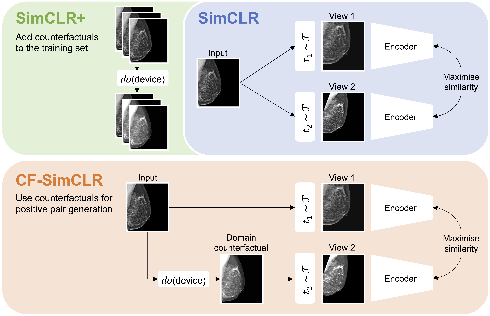

# Robust representations for image classification via counterfactual contrastive learning

This repository contains the code for the papers "Counterfactual contrastive learning: robust representations via causal image synthesis" and extended version "Robust representations for image classification via counterfactual contrastive learning". <br>
[Extended journal version, Medical Image Analysis, 2025](https://www.sciencedirect.com/science/article/pii/S1361841525002154?via%3Dihub)<br>
[Conference paper version, presented at Data Engineering Workshop @ MICCAI 2024](https://arxiv.org/abs/2403.09605)<br>



Paper references:
```
@article{roschewitz2025robust,
  title={Robust image representations with counterfactual contrastive learning},
  author={Roschewitz, M{\'e}lanie and Ribeiro, Fabio De Sousa and Xia, Tian and Khara, Galvin and Glocker, Ben},
  journal={Medical Image Analysis},
  pages={103668},
  year={2025},
  publisher={Elsevier}
}

@inproceedings{roschewitz2024counterfactual,
  title={Counterfactual contrastive learning: robust representations via causal image synthesis},
  author={Roschewitz, M{\'e}lanie and de Sousa Ribeiro, Fabio and Xia, Tian and Khara, Galvin and Glocker, Ben},
  booktitle={MICCAI Workshop on Data Engineering in Medical Imaging},
  pages={22--32},
  year={2024},
  organization={Springer}
}
```

## Overview
The repository is divided in three main parts:
* The [causal_model/](causal_models/) folder contains all code related to counterfactual inference model training. It contains its own README, giving you all necessary commands to train a DSCM on EMBED and PadChest.
* The [classification/](classification/) folder contains all the code related to self-supervised training as well as finetuning for evaluation (see below).
* The [data_handling/](data_handling/) folder contains everything you need to define your dataset classes. In particular, it contains all the boilerplate for CF-SimCLR specific data loading.
* The [evaluation/](evaluation/) folder contains all the code related to test inference and results plotting for reproducing the plots from the paper. 


## Prerequisites

### Code dependencies
The code is written in PyTorch, with PyTorch Lightning. 
You can install all our dependencies using our conda enviromnent requirements file `environment_gpu.yml`. 

### Datasets
You will need to download the relevant datasets to run our code. 
All datasets are publicly available and be downloaded at:
* PadChest [https://bimcv.cipf.es/bimcv-projects/padchest/](https://bimcv.cipf.es/bimcv-projects/padchest/), [https://www.sciencedirect.com/science/article/pii/S1361841520301614](https://www.sciencedirect.com/science/article/pii/S1361841520301614)
* RSNA Pneumonia Detection Dataset: [https://www.kaggle.com/c/rsna-pneumonia-detection-challenge](https://www.kaggle.com/c/rsna-pneumonia-detection-challenge)
* CheXpert [https://stanfordaimi.azurewebsites.net/datasets/8cbd9ed4-2eb9-4565-affc-111cf4f7ebe2](https://stanfordaimi.azurewebsites.net/datasets/8cbd9ed4-2eb9-4565-affc-111cf4f7ebe2)
* EMBED [https://pubs.rsna.org/doi/full/10.1148/ryai.220047](https://pubs.rsna.org/doi/full/10.1148/ryai.220047), [https://github.com/Emory-HITI/EMBED_Open_Data/tree/main](https://github.com/Emory-HITI/EMBED_Open_Data/tree/main)
* VinDR Mammo [https://vindr.ai/datasets/mammo](https://vindr.ai/datasets/mammo)

Once you have downloaded the datasets, please update the corresponding paths at the top of the `mammo.py` and `xray.py` files.
Additionally, for EMBED you will need to preprocess the original dataframes with our script `data_handling/csv_generation_code/generate_embed_csv.ipynb`. Similarly for RSNA please run first `data_handling/csv_generation_code/rsna_generate_full_csv.py`.


## Full workflow example for training and evaluating CF-SimCLR on mammography
Here we'll run through an example to train and evaluate CF-SimCLR on EMBED

1. Train a counterfactual image generation model with 
```
python causal_models/main.py --hps embed
```

2. Generate and save all counterfactuals from every image in the training set with
```
python causal_models/save_embed_scanner_cf.py
```

3. Train the CF-SimCLR model
``` 
python classification/train.py experiment=simclr_embed data.use_counterfactuals=True data.counterfactual_contrastive=True
```
Alternatively to train a SimCLR baseline just run
``` 
python classification/train.py experiment=simclr_embed
```
Or to run the baseline with counterfactuals added to the training set without counterfactual contrastive objective
``` 
python classification/train.py experiment=simclr_embed data.use_counterfactuals=True counterfactual_contrastive=False
```

4. Train classifier with linear finetuning or finetuning
```
python classification/train.py experiment=base_density trainer.finetune_path=PATH_TO_ENCODER seed=33 trainer.freeze_encoder=True
```
You can choose the proportion of labelled data to use for finetuning with the flag `data.prop_train=1.0`

5. Evaluate on the test set by running the inference code `evaluation/simclr_embed.py` to run and save inference results on the test set. 
